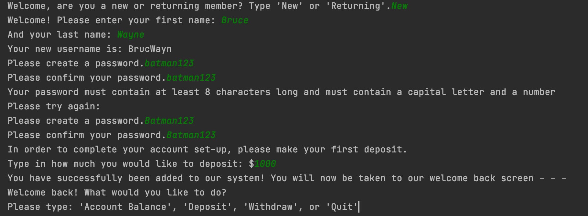
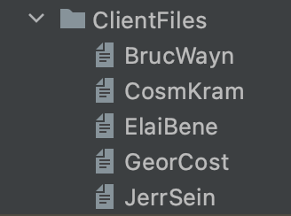
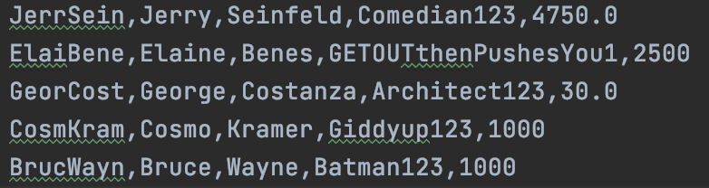
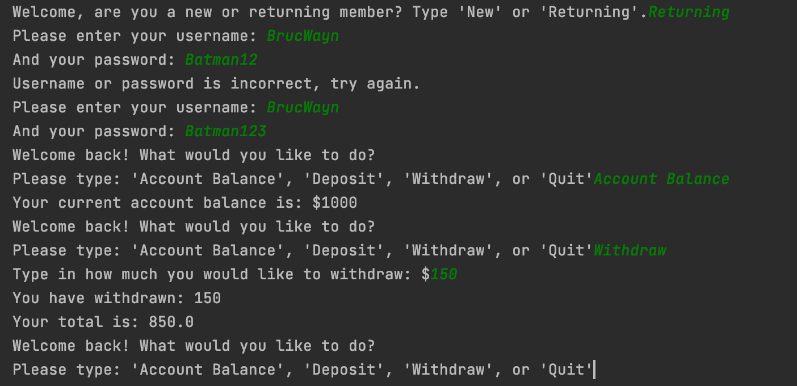
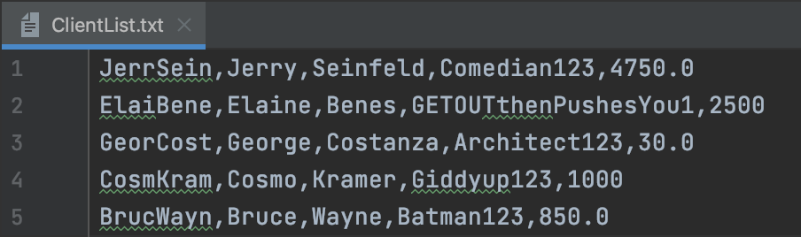
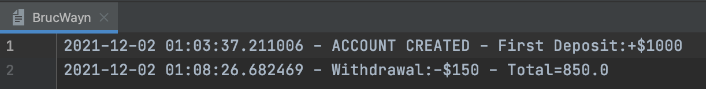

# BankApp
This program is a sample banking app, it:
- Takes in user information such as first and last name
- Creates a unique username (even for users with the same first and last name)
- Requires a password with certain specifications (Requires a capital and a number)
- Validates username and password of returning users
- Updates the ClientList.txt file with the new user
- Creates a transaction file unique to each user where it keeps track of every monetary action the user makes
- Is coded in Python and uses csv, os, and datetime modules

## How it works:
1. Upon starting the program, the user will have a interaction like this:

  
 

2. Once the user information is entered, the ClientFiles folder is updated with the new and unique user transaction file and the ClientList.txt file is also updated:

  

  

3. Now the user can rerun the program as a returning user and will have an interaction like this:

  

4. Then both the ClientList.txt file will be updated with the new balance on the account and the user transaction file will record the actions taken:

  

  

Thank you for checking out my Program!
